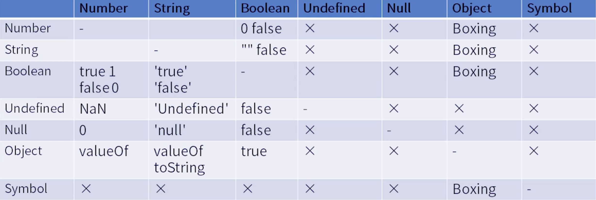

## 重学javascript（二）
### 运算符和表达式
1. Member
    * 成员访问：a.b, a[b]
    * foo\`string`
    * super关键字
      * super.b
      * super['b']
    * new.target
    * new Foo();
      > 带括号的new优先级更高，如 `new a()()` 和 `new new foo()`中，第一个第一个应该是 `(new a())()`，第二个应该是`new (new foo())`
2. Reference
    * Object
    * Key
    * delete
    * assign
3. Expression
    * Call
      * foo()
      * super()
      * foo().b
      * foo()['b']
      * foo()\`abc`
    * Left Handside (从左向右)
      * 
    * Right Handside (从右向左)
      * Update, Eg:
        * a++、a--、++a、--a
        > 如：`++a++` 实际上为 `++(a++)`,所以它是不合法的
    * 单目运算符
      * delete
      * void
      * typeof
      * +a、-a、~a、！a
      * await
    * Exponental
      * \** 乘方
        > `2**3**2`实际上运算顺序为：`2**(1**2)`，最终结果为2
    * 四则运算
      * Multiplication：* / %
      * Addtive：+ -
      * shift（位运算）：
      * 关系比较表达式：>、 <、 >=、 <=、instanceof
    * 相等比较
      * ==
      * !=
      * ===
      * !==
    * BitWise（按位与）
      * & ^ |
    * Logical（逻辑运算）
      * &&、||
      > 注意有短路原则（一定情况下可以代替if）不是所有表达式的子结构都会被执行
    * conditional
      * a ? b : c
      > 注意有短路原则（一定情况下可以代替if）不是所有表达式的子结构都会被执行
### 类型转换

### 语句
> * [[type]]: normal/break/continue/return/throw 
> * [[value]]: 基本类型 
> * [[target]]: label 

语句主要分为：简单语句、组合语句、声明
1. 简单语句：
    * 表达式语句
    * 空语句
    * 调试（debug）语句
    * throw语句
    * break语句
    * continue语句
    * return语句
2. 组合（复合）语句
    * BlockStatement
      * 可以容纳多个语句
    * IfStatement
    * SwitchStatement
    * IterationStatement
      * `while`、`do while`、`for()`、`for(...in)/for(...of)`
    * WithStatement
    * LabelledStatement（给循环结构取名字）
    * TryStatement
3. 声明（这里将“对后续语句发生作用的语句”都归类于声明，次归类方式不一定和js标准一致）
  * 声明方式
  > 以下五种可以存在变量提升
  > * Function
  > * Generaor
  > * AsyncFunction
  > * AsyncGeneraor
  > * Variable
---------------
  > 以下几种声明方式没有变量提升
  > * Class
  > * Lexical：let、const
* 预处理
> 所有的变量声明都有预处理机制，只是有些声明方式不存在变量提升
* 作用域
### 宏任务与微任务
> **宏任务**：针对JS引擎； **微任务**：针对JS内部